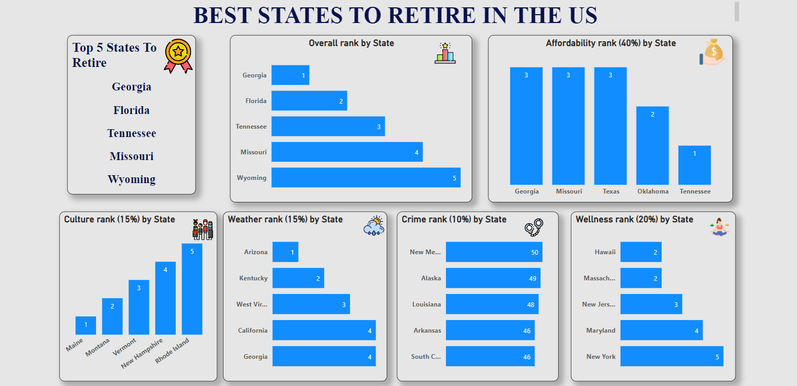
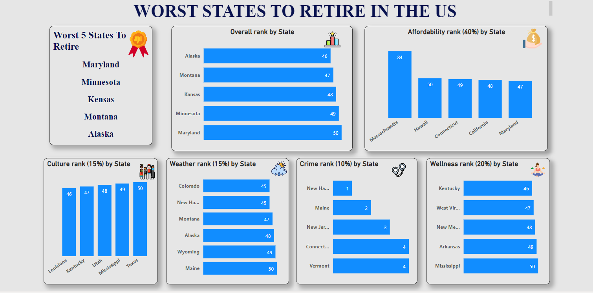

# Project Name: Best and Worst States to Retire in The US
These are Power Bi designed Dashboards showing Best and Worst States to Retire in The US.
# Problem Statement:
To analyze The Best and The Worst States to Retire in The United State using Bankrate Metrics;
Affordability,
Wellness,
Culture,
Weather and
Crime.
# Data Sourcing:
Data source was web source,from https://www.bankrate.com/retirement/best-and-worst-states-for-retirement/
# Data Cleaning:
This was done via Transfomation prior toloading the data from Power quary.
# Findings:

With reference to Bankrate,Georgia is the best state to retire in the US,

Arizona has the best weather,
The crime rate at New hampshire is high and Tennessee is relatively most affordable,
The Weather in Maine is relatively worse with high crime rate.
# Recommendations:
Investments in States like Georgia,Florida and Tennessee will thrive more than other places.
